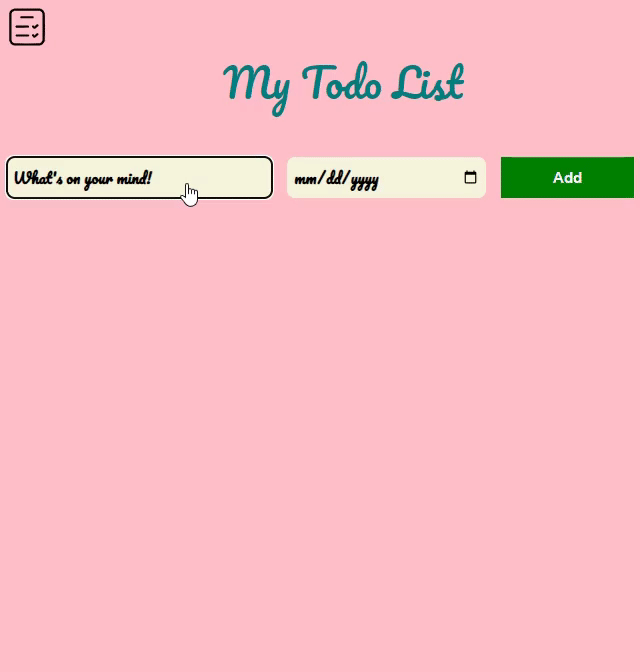

# To-Do List Website
---
## Overview

This is a basic To-Do List website built using HTML, CSS, and JavaScript. It allows users to add, and remove tasks to manage their daily activities.

## Features

- **Add Task:** Easily add new tasks to the to-do list.
- **Remove Task:** Remove completed or unwanted tasks.

## Getting Started

1. Clone the repository:

   ```bash
   git clone https://github.com/Amrit-Sharma-7/ToDo-List-Project.git
   ```

2. Open the project folder:

   ```bash
   cd ToDo-List-Project
   ```

3. Open `todo-list.html` in your preferred web browser.

## Usage

1. **Add a Task:**
   - Type the task in the input field.
   - Select a date from the date selector(Optional).
   - Press the "Add" button.

3. **Remove a Task:**
   - Hover over the task you want to remove.
   - Click the "Delete" button.

## Structure

- **todo-list.html:** Main HTML file containing the structure of the webpage.
- **todo-list.css:** Stylesheet for the website, controlling its appearance.
- **todo-list.js:** JavaScript file handling dynamic functionality.

## Demo

Live Link: [ToDo List](https://amrit-sharma-7.github.io/ToDo-List-Project/todo-list.html)





## Technologies Used

- HTML
- CSS
- JavaScript

## Contributing

If you'd like to contribute to the project, please follow these steps:

1. Fork the repository.
2. Create a new branch for your feature or bug fix.
3. Make your changes and commit them.
4. Push to your fork and submit a pull request.
